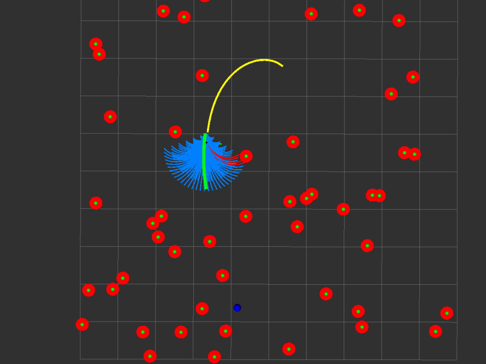
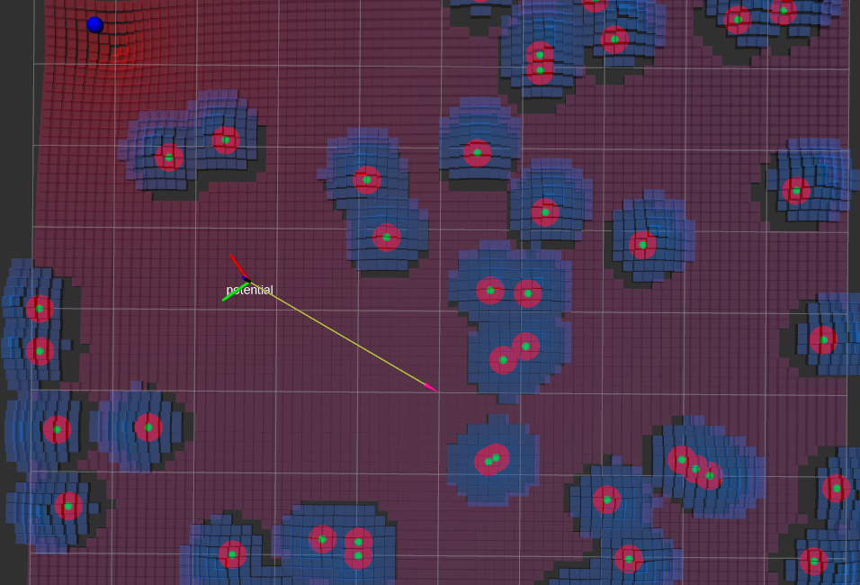
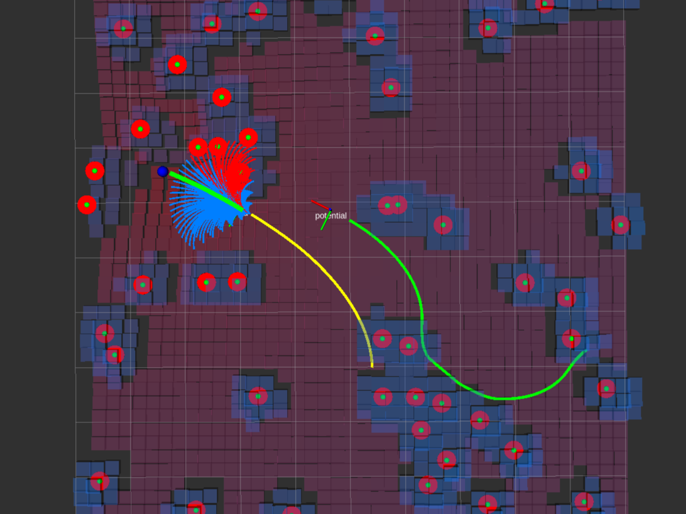

# Local Path Planning Tutorial
ローカルパスプランニングとは、環境の状況によって経路を生成する手法です。
この「Local Path Planning Tutorial」では、2つのアルゴリズムを実装し、理解する。

## Dynamic Window Approach(DWA)
- 現在の位置情報
- 現在の速度情報
- ロボット周辺の障害物情報
- ゴールの位置情報

以上の情報から，ロボットの運動モデルに則した制御入力を計算する検索ベースのローカル経路生成アルゴリズムである．

```bash
$ roslaunch local_path_planning_tutorial dwa_path_generator.launch 
```

<div align="center">
    
</div>

# Reference
- [The Dynamic Window Approach to Collision Avoidance](https://www.researchgate.net/publication/3344494_The_Dynamic_Window_Approach_to_Collision_Avoidance)
- [Dynamic Window Approachを利用したMotion planningのMATLAB, Python サンプルプログラム](https://myenigma.hatenablog.com/entry/20140624/1403618922)

## Potential Method
障害物と目標位置の座標にポテンシャル関数と呼ばれる関数を定義し，その関数の勾配（座標成分ごとの偏微分）から進むべき方向を導出する手法である． 

```bash
$ roslaunch local_path_planning_tutorial potential_method_path_generator.launch 
```

<div align="center">
    
</div>

# Reference
[ポテンシャル法によるロボット製品の障害物回避技術の開発](https://www.mhi.co.jp/technology/review/pdf/511/511040.pdf)

## Comparison
DWAとPotential Methodの経路の比較ができるプログラム

```bash
$ roslaunch local_path_planning_tutorial local_path_planning_comparison.launch 
```
rvizの2D Nav Goalで目標位置を決定すると，経路生成を開始します．

<div align="center">
    
</div>

